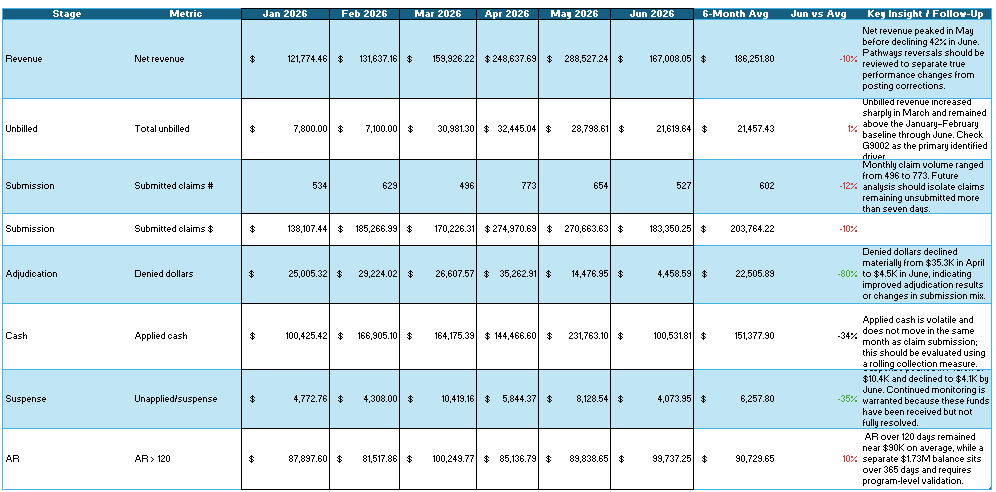

# Healthcare Revenue Cycle Analytics Prototype

## Project Overview

Healthcare finance leaders often receive financial reports after revenue has already been recognized. Operational billing activity and financial reporting may be viewed separately, limiting visibility into the factors affecting cash flow and receivable performance.

This project develops an Excel-based prototype that connects operational healthcare billing metrics with financial performance indicators across the insurance revenue cycle.

## Business Objective

Create a concise management tool that follows revenue from charge capture through claim submission, adjudication, cash posting, and accounts receivable.

## Dashboard Preview

### Executive Scorecard

### Operational Performance

### Program Analytics

### Payer Analytics

## Key Metrics

- Net revenue
- Unbilled revenue
- Submitted claim volume and dollars
- Denied dollars and denial rate
- Applied cash and cash collection rate
- Unapplied cash and suspense
- Accounts receivable over 120 days
- Failed activity rate
- Program service volume
- Payer service concentration

## Key Findings

- Denial rates improved materially by June.
- Cash collections remained volatile despite declining denials.
- Unbilled revenue increased sharply during March and April.
- Suspense declined after reaching a March peak.
- Accounts receivable over 120 days remained persistent.
- The three largest payers represented approximately 61% of service records.

## Analytical Workflow

1. Reviewed reports across the healthcare revenue cycle.
2. Consolidated monthly operational and financial metrics.
3. Standardized program, payer, and service-level data.
4. Calculated revenue-cycle performance indicators.
5. Developed executive and operational dashboard views.
6. Documented findings, limitations, and future enhancements.

## Tools and Skills

- Microsoft Excel
- PivotTables and PivotCharts
- Power Query
- KPI development
- Healthcare revenue-cycle analysis
- Operational and financial reporting
- CareLogic and NetSuite process knowledge

## Data Privacy

The portfolio dataset has been anonymized. Program, payer, staff, client, and claim identifiers were replaced with generic labels. No protected health information or proprietary organizational data is included.

## Current Limitations

- Several source reports were available only as PDF files.
- Monthly metrics were manually consolidated.
- Cash receipts do not necessarily align with claims submitted in the same month.
- First-pass acceptance rate and days-to-submit were not available.
- Operational aging may not fully reconcile to general-ledger or board-reporting balances.

## Future Enhancements

- Automate PDF extraction with Python or Power Query.
- Add denial reason and payer reimbursement analysis.
- Calculate service-to-claim and claim-to-payment timing.
- Integrate financial-system cash and revenue data.
- Develop an interactive Power BI version.

## Workbook

Download the complete Excel prototype:

[Healthcare Revenue Cycle Analytics Workbook](healthcare-revenue-cycle-analytics-prototype.xlsx)
